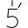

# Pomodoro Ninja

A tool for Pomodoro Technique.

## Requirement

This is a Gadget for Windows Vista or Windows 7.  
If you are a Windows 8/10, Unix/Linux or a OSX user, it can also run on [Electron](http://electron.atom.io/) or [NW.js (ex node-webkit)](http://nwjs.io/).

## Installation

1. [Download sources](https://github.com/maxpou/podoro-ninja.gadget/archive/master.zip)
2. Unzip here :
  * Windows Vista : c:\Program Files\Windows Sidebar\Gadgets
  * Windows 7 : Unzip all files in C:\Users\<username>\AppData\Local\Microsoft\Windows Sidebar\Gadgets
3. On desktop, right clic > Gadget > Select **Pomodoro Ninja**

*Note: All widgets folders must have .gadget extension.*

:+1:: right clic > always visible

## Timers

* : Set timer to 25 minutes
* : Set timer to 5 minutes
* : Set timer to 15 minutes

## Icon credit

Icons made by <a href="http://www.flaticon.com/authors/daniel-bruce" title="Daniel Bruce">Daniel Bruce</a>, <a href="http://www.flaticon.com/authors/elegant-themes" title="Elegant Themes">Elegant Themes</a>, <a href="http://www.freepik.com" title="Freepik">Freepik</a>, <a href="http://www.flaticon.com/authors/egor-rumyantsev" title="Egor Rumyantsev">Egor Rumyantsev</a>, <a href="http://www.flaticon.com/authors/dot-on-paper" title="Dot on Paper">Dot on Paper</a> from <a href="http://www.flaticon.com" title="Flaticon">www.flaticon.com</a>             is licensed by <a href="http://creativecommons.org/licenses/by/3.0/" title="Creative Commons BY 3.0">CC BY 3.0</a>

